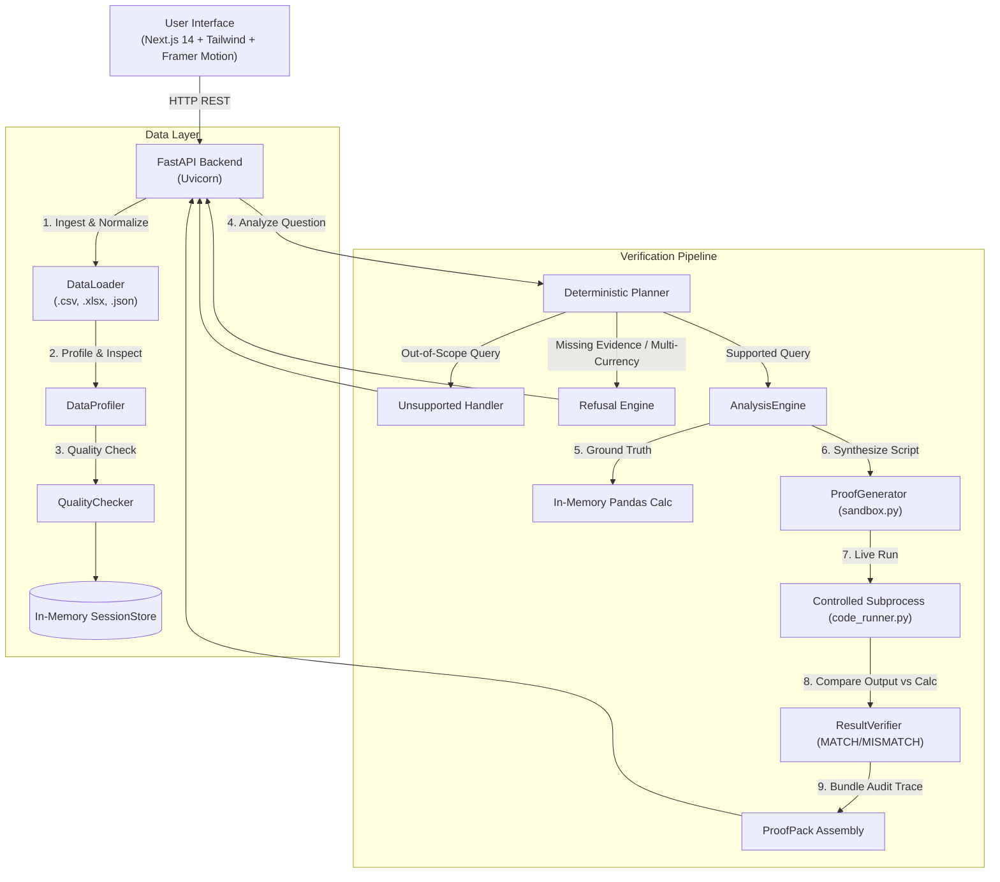

# AUTOBOTZZ
## Proof-Carrying Data Analyst

**Problem Statement:** HNX26PSI08 — Proof-Carrying Data Analyst  
**Competition:** HackNex 2026 Internal Qualifier  
**Team:** AUTOBOTZZ  

---

### Overview

**AUTOBOTZZ** is a proof-carrying data analysis system that inspects tabular operational datasets and attaches executable, independently verifiable evidence to every numerical answer it provides.

Traditional AI-assisted data analysts frequently present hallucinated figures, obscure accounting flaws, or make silent assumptions. AUTOBOTZZ replaces unverified numerical claims with a deterministic verification pipeline:

```
Question
   │
   ▼
Deterministic Planning
   │
   ▼
Data-Quality Checks & Anomaly Audits
   │
   ▼
In-Memory Ground-Truth Calculation
   │
   ▼
Reproducible Proof-Code Generation
   │
   ▼
Controlled Subprocess Execution
   │
   ▼
Independent Result Verification (Calculated == Executed)
   │
   ▼
ProofPack™ (Verified Answer / Warning / Refusal / Unsupported)
```

**Core Principle:** *Every numerical answer should be reproducible. If required evidence is missing, conflicting, or the question cannot be answered reliably, the system must refuse rather than fabricate an answer.*

---

### Problem Being Solved

1. **Messy Operational Data:** Real-world CSV and Excel files frequently contain duplicate transactions, inconsistent formats, and null anomalies that silently corrupt aggregations.
2. **The "Black Box" Metric Trap:** Dashboards and language models present final numbers without exposing the exact relational algebra, filters, or accounting decisions used to derive them.
3. **Multi-Currency & Evidence Gaps:** Datasets often mix currencies (e.g. USD and INR) without providing pegged conversion dates or exchange-rate tables, leading typical tools to blindly sum discordant units.
4. **Unverifiable Arithmetic:** Analysts lack a straightforward way to confirm whether a reported figure came from actual data execution or synthetic speculation.

---

### Key Features (Implemented MVP)

* **Tabular File Ingestion:** Multipart upload and normalization for `.csv`, `.xlsx`, and `.json` datasets.
* **Schema & Anomaly Profiling:** Automatic row/column counting, dtype inference, null percentages, distinct value tracking, and semantic type detection.
* **Data Quality Audits:** Pre-computation scans detecting duplicate rows, duplicate primary keys, empty columns, constant values, unpegged multi-currency records, and ambiguous date formats.
* **Deterministic Query Planning:** Relational intent parsing mapping questions to validated analytical operations (`NET_REVENUE`, `COUNT_DUPLICATES`, `FILTER_SUM`, `UNSUPPORTED`).
* **Pandas Calculation Engine:** Ground-truth metrics calculated over real DataFrames with explicit data-handling decisions (e.g. quarantining duplicate transactions).
* **Standalone Python Proof Script Generation:** Generates self-contained, rerunnable Python scripts from vetted templates.
* **Controlled Subprocess Execution:** Live execution of generated proof scripts in an isolated Python subprocess (`subprocess.run`) with timeout protection, capturing stdout, stderr, exit code, and execution time.
* **Independent Result Verification:** Mathematical comparison engine reconciling in-memory calculated values against subprocess stdout (`MATCH` / `MISMATCH`).
* **ProofPack™ Bundle:** Comprehensive audit package containing reported answer, arithmetic step breakdown, data lineage, assumptions, quality findings, generated proof script, and subprocess telemetry.
* **Deterministic Refusal:** Refusal barrier halting computation when evidence is insufficient (e.g. unpegged multi-currency data without FX spot tables).
* **Explicit Unsupported Query Handling:** Out-of-scope questions (e.g. multidimensional product category breakdowns) return an honest `UNSUPPORTED ANALYSIS` outcome rather than an incorrect answer.
* **Physical Demo Dataset Synchronization:** Direct backend loader ingesting real physical fixtures from `datasets/demo/`.

#### Out-of-Scope Capabilities (Explicit Non-Claims)
* Arbitrary universal natural-language reasoning (unsupported queries are rejected).
* Cryptographic SHA-256 ledger or blockchain verification (bundle IDs are structural identifiers).
* Docker container isolation or kernel-level sandboxing (uses controlled Python subprocesses with timeouts).
* External LLM-driven runtime calculations (calculations are deterministic pandas operations).
* Production multi-user authentication and database persistence (uses an in-memory session store).
* PDF or OCR document parsing.

---

### Architecture



---

### Tech Stack

#### Backend
* **Language & Runtime:** Python 3.10+ (tested on Python 3.14)
* **API Framework:** FastAPI 0.110+, Pydantic v2, Uvicorn
* **Data Processing:** pandas 2.2+, NumPy 1.26+, openpyxl 3.1+
* **Execution:** Python `subprocess` runner with timeout management
* **Testing:** pytest 8.0+, HTTPX TestClient

#### Frontend
* **Framework:** Next.js 14.2 (App Router)
* **Language:** TypeScript 5.6
* **Styling:** Tailwind CSS, PostCSS
* **Animation:** Framer Motion 11
* **Icons:** Lucide React

---

### Project Structure

```
AUTOBOTTZZZZ/
├── backend/
│   ├── app/
│   │   ├── agents/
│   │   │   └── planner.py            # Deterministic intent parser & rule engine
│   │   ├── api/
│   │   │   ├── analysis.py           # POST /api/analysis
│   │   │   └── datasets.py           # Dataset upload, status, and demo loading
│   │   ├── core/
│   │   │   ├── config.py             # Application settings & allowed extensions
│   │   │   └── security.py           # Filename sanitization & path safety
│   │   ├── execution/
│   │   │   ├── code_runner.py        # Controlled Python subprocess runner
│   │   │   └── sandbox.py            # Reproducible standalone script generator
│   │   ├── models/
│   │   │   ├── analysis.py           # Plan & query schemas
│   │   │   ├── dataset.py            # Schema, column, and profile models
│   │   │   └── proof.py              # ProofPack, telemetry, and verification models
│   │   ├── services/
│   │   │   ├── analysis_engine.py    # Core analysis and execution coordinator
│   │   │   ├── data_loader.py        # Tabular parser (CSV, XLSX, JSON)
│   │   │   ├── data_profiler.py      # Statistical profiling & metadata inference
│   │   │   └── session_store.py      # In-memory dataset catalog
│   │   ├── utils/
│   │   │   └── logging.py            # Structured logging
│   │   ├── verification/
│   │   │   ├── quality_checker.py    # Rule-based data quality auditor
│   │   │   └── result_verifier.py    # Mathematical output reconciler
│   │   └── main.py                   # FastAPI application entrypoint
│   ├── tests/                        # 31 comprehensive pytest test suites
│   └── requirements.txt              # Declared backend dependencies
├── datasets/
│   └── demo/                         # Physical tabular demo fixtures
│       ├── customers.csv             # Customer accounts
│       ├── orders.csv                # Order transactions (includes duplicate fixture)
│       ├── payments.csv              # Multi-currency payment records
│       └── refunds.csv               # Refund line items
├── docs/
│   ├── architecture.md               # In-depth system architecture documentation
│   └── scope.md                      # Detailed MVP capability matrix
├── frontend/
│   ├── src/
│   │   ├── app/                      # Next.js App Router entrypoints
│   │   ├── components/               # UI components (Analyst, Results, Refusal, Upload)
│   │   ├── hooks/                    # useAnalysis, useFileUpload
│   │   ├── services/                 # analysisService, datasetService
│   │   └── types/                    # TypeScript interfaces for ProofPacks and datasets
│   ├── package.json                  # Frontend dependencies and scripts
│   └── tsconfig.json                 # Strict TypeScript configuration
├── .env.example                      # Environment template
├── .gitignore                        # Git exclusion rules
└── README.md                         # Project documentation
```

---

### Installation & Setup

#### Prerequisites
* **Python:** 3.10 or higher
* **Node.js:** 18 or higher (tested on Node v20/v24)
* **Package Managers:** `pip` and `npm`

#### 1. Backend Setup

```bash
# Navigate to backend directory
cd backend

# Install dependencies
python -m pip install -r requirements.txt

# Start FastAPI development server
python -m uvicorn app.main:app --reload --port 8000
```

Verify backend health:
* Health Endpoint: [http://localhost:8000/health](http://localhost:8000/health)
* Interactive Swagger Docs: [http://localhost:8000/docs](http://localhost:8000/docs)

#### 2. Frontend Setup

```bash
# Navigate to frontend directory in a separate terminal
cd frontend

# Install dependencies
npm install

# Start Next.js development server
npm run dev
```

Open application:
* Frontend Workspace: [http://localhost:3000](http://localhost:3000)

---

### Reproducing the Qualifier Demo

1. Start both backend (`localhost:8000`) and frontend (`localhost:3000`).
2. Open [http://localhost:3000](http://localhost:3000).
3. Click **"Load Demo Data (4 Datasets)"**.
   * Confirms loading of 4 physical files: `customers.csv`, `orders.csv`, `payments.csv`, and `refunds.csv`.
   * Real dataset profiles and detected anomalies appear in the active catalog.

#### Flow A: Verified Net Revenue with Duplicate Handling
* **Question:** `"What was net revenue in September after refunds?"`
* **Expected Outcome:** `VERIFIED WITH DATA HANDLING` (Warning State)
* **Reported Answer:** `₹150,400.50`
* **Verification Status:** `MATCH`
* **Accounting Logic:**
  1. Orders filtered to `status == 'completed'` and `order_date` in September 2026.
  2. Duplicate order record `ORD-8902` quarantined (keeping first occurrence).
  3. Gross completed orders total: **₹157,400.50**.
  4. Refunds filtered to `status == 'completed'`, `refund_date` in September 2026, and restricted to completed order IDs (`REF-201`, `REF-202`, `REF-205`). Refund `REF-203` (belonging to non-completed order row 8) is excluded.
  5. Eligible refunds total: **₹7,000.00**.
  6. Net Revenue: $157,400.50 - 7,000.00 = \mathbf{₹150,400.50}$.
  7. Standalone Python proof script runs in a live subprocess and outputs `₹150,400.50`.
  8. Result Verifier confirms byte-for-byte reconciliation.

#### Flow B: Integrity Duplicate Audit
* **Question:** `"How many duplicate orders exist in the transactions log?"`
* **Expected Outcome:** `VERIFIED DETERMINISTIC COMPUTATION`
* **Reported Answer:** `1 duplicate orders`
* **Verification Status:** `MATCH`
* **Explanation:** Identifies duplicate record `ORD-8902` in `orders.csv`.

#### Flow C: Truthful Refusal (Multi-Currency Trap)
* **Question:** `"Convert all USD and INR revenue into INR."`
* **Expected Outcome:** `CANNOT VERIFY RELIABLY` (Deliberate Policy Halt)
* **Headline:** `REFUSAL: Insufficient Evidence for Multi-Currency Conversion`
* **Behavior:** Analysis halts at evidence validation. No fake code or simulated execution is generated. The UI truthfully states: *"No execution was required because analysis stopped at the evidence validation stage."*

#### Flow D: Unsupported Analysis (Category Breakdown)
* **Question:** `"Which product category generated the highest net revenue?"`
* **Expected Outcome:** `UNSUPPORTED ANALYSIS`
* **Behavior:** Deterministic planner identifies multidimensional category breakdown as outside MVP scope and returns an explicit unsupported outcome rather than guessing.

#### Flow E: Backend Offline Resilience
* Stop the FastAPI backend process.
* Submit any query in the frontend.
* **Behavior:** The UI displays an explicit **BACKEND UNAVAILABLE** banner with connection guidance. Zero silent mock fallback occurs.

---

### Sample Input & Output

| Question | Operation | Status | Reported Value | Subprocess Stdout | Verification |
|---|---|---|---|---|---|
| *"What was net revenue in September after refunds?"* | `NET_REVENUE` | `warning` | `₹150,400.50` | `₹150,400.50` | **MATCH** |
| *"How many duplicate orders exist in the transactions log?"* | `COUNT_DUPLICATES` | `verified` | `1 duplicate orders` | `1` | **MATCH** |
| *"What is total completed order revenue?"* | `FILTER_SUM` | `warning` | `₹157,400.50` | `₹157,400.50` | **MATCH** |
| *"Convert all USD and INR revenue into INR."* | `CURRENCY_REFUSAL` | `refused` | `None` | `None` | **HALTED** |
| *"Which product category generated highest revenue?"* | `UNSUPPORTED` | `unsupported` | `None` | `None` | **UNSUPPORTED** |

---

### Anatomy of a ProofPack™

A **ProofPack** is a complete, self-contained audit bundle emitted with every completed analysis:

```json
{
  "id": "PP-2026-00101",
  "question": "What was net revenue in September after refunds?",
  "outcome": "warning",
  "headlineAnswer": "₹150,400.50",
  "metricLabel": "Net September Revenue",
  "calculationBreakdown": [
    { "label": "Gross Completed Orders (September)", "value": "₹157,400.50", "operation": "add" },
    { "label": "Completed Refunds Deducted", "value": "-₹7,000.00", "operation": "subtract" },
    { "label": "Net September Revenue", "value": "₹150,400.50", "operation": "result" }
  ],
  "assumptions": [
    "Deduplicated orders.csv by order_id keeping first occurrence (1 duplicate removed)",
    "Included only orders with status == 'completed' in September 2026",
    "Subtracted only completed refunds belonging to completed orders"
  ],
  "datasets": ["orders.csv", "refunds.csv"],
  "sources": [
    { "filename": "orders.csv", "columnsUsed": ["order_id", "order_date", "total_amount", "status"], "rowsInvolved": 10 },
    { "filename": "refunds.csv", "columnsUsed": ["order_id", "refund_date", "amount", "status"], "rowsInvolved": 3 }
  ],
  "dataQualityIssues": [
    { "title": "DUPLICATE IDENTIFIERS", "datasetName": "orders.csv", "impact": "Overstates gross revenue if unhandled" }
  ],
  "generatedCode": {
    "language": "python",
    "lineCount": 24,
    "code": "import pandas as pd\n..."
  },
  "execution": {
    "stdout": "₹150,400.50\n",
    "stderr": null,
    "exitCode": 0,
    "executionTimeMs": 28.4
  },
  "verification": {
    "status": "MATCH",
    "reportedValue": "₹150,400.50",
    "executionValue": "₹150,400.50",
    "isVerified": true
  },
  "confidence": { "score": 1.0, "level": "HIGH" }
}
```

---

### Verification and Testing

Automated verification suites confirm backend calculation accuracy and frontend production stability:

#### Backend Test Suite
```bash
cd backend
python -m pytest tests -v
```
* **Checkpoint Status:** **31 / 31 passed (100%)**
* Covers: data loading (CSV, UTF-8 BOM, JSON, XLSX), quality audits (duplicates, multi-currency, dates), intent planning, code generation, subprocess execution, result verification, and API endpoints.

#### Frontend Code Quality & Build
```bash
cd frontend
npm run lint
npm run build
```
* **ESLint Status:** Clean (0 errors, 0 warnings)
* **Next.js Production Build:** Successful static page generation (Exit Code 0)

#### Benchmark Suite & Dataset Evaluation
External adversarial datasets, specifications, and validation tooling are organized under `benchmark/`:
```bash
# 1. Dataset Integrity Validation (68 structural & domain checks)
python benchmark/tools/validate_dataset.py

# 2. Ground-Truth Reference Verification (36 analytical cases)
python benchmark/tools/ground_truth.py

# 3. Selected Demo-Case Pipeline Evaluation (Member 2 Recommended Set)
python benchmark/tools/eval_demo_cases.py
```
* **Dataset Integrity Validation:** **68 / 68 checks passed (100%)** across clean and messy benchmark fixtures.
* **Ground-Truth Reference Verification:** **36 / 36 cases computed and verified** against pandas reference logic.
* **Selected Demo-Case Pipeline Evaluation:**
  * Supported operations: **2 / 2 passed with 100% precision** (`TC-C01` duplicate audit verified with `MATCH`, `TC-F03` multi-currency query correctly refused under zero-hallucination policy).
  * Out-of-scope operations: **3 / 3 safely handled as `UNSUPPORTED ANALYSIS`** (`TC-A02`, `TC-B04`, `TC-D02`).
  * Execution crashes / unexpected failures: **0**.

---

### Known Limitations (Qualifier Scope)

* **In-Memory Session Store:** Dataset files and profiles reside in backend process memory (`SessionStore`). Restarting the backend clears active uploads; demo data must be reloaded.
* **Deterministic Intent Bounds:** The planner supports relational algebra templates tailored to the qualifier problem statements. Freeform arbitrary queries outside these templates are marked as `UNSUPPORTED ANALYSIS`.
* **First-100-Row Profiling:** For rapid interactive response, deep date and currency regex scans inspect the first 100 records of large tables.
* **Subprocess Execution:** Code execution runs through `subprocess.run` with a 10-second timeout rather than a dedicated virtualized container sandbox.

---

### Resources & Development Disclosure

* **Core Libraries:** FastAPI, Uvicorn, pandas, openpyxl, Next.js, Framer Motion, Tailwind CSS, Lucide.
* **Development Disclosure:** AI development tools were utilized for boilerplate synthesis, interface styling, and test generation. All mathematical models, calculation logic, relational plans, and verification pipelines were designed, reviewed, and verified by the team. No external language model is invoked during runtime analysis.

---

### Team

**Team Name:** AUTOBOTZZ  
**Submission:** HackNex 2026 Internal Qualifier
